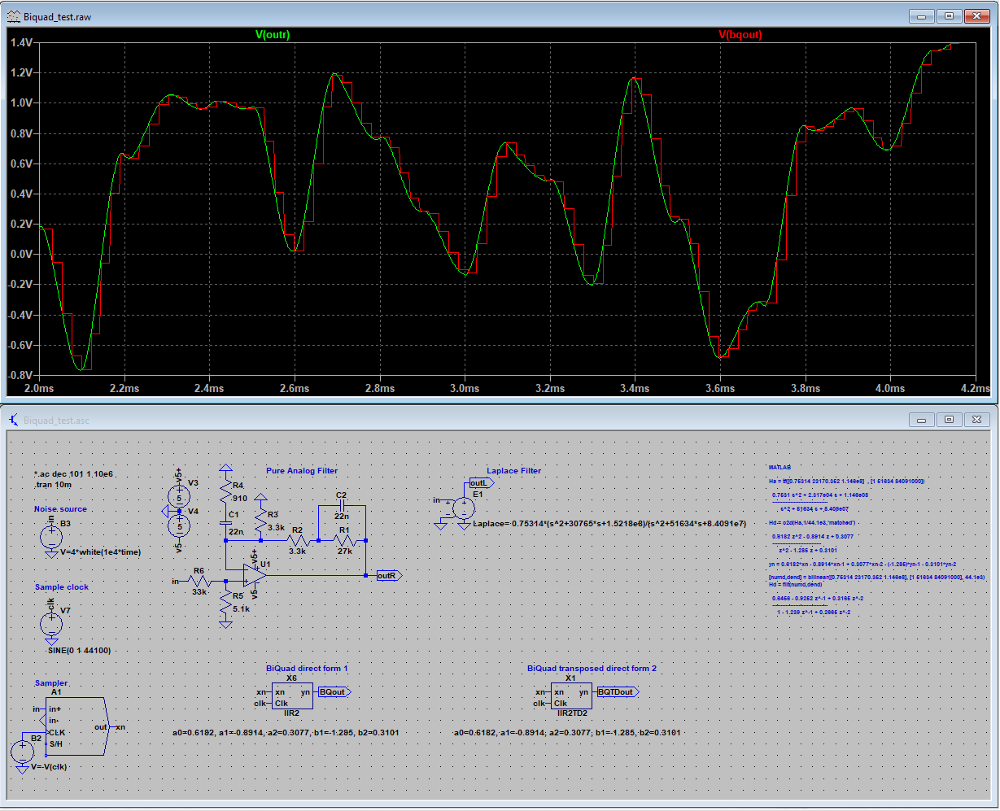

# BiQuad filter LTSpice
 It is possible to simulate digtal filters in LTSpice. This was shown in by Erick Cook on EDN
 https://www.edn.com/use-ltspice-to-simulate-mixed-continuous-and-sampled-systems/
 
 Here is a cleaned up version with easier interface. 
 Included are building blocks to make: 
 Delays (Z-1) 
 Single or BiQuads in direct form 1 (better option for reduced precision like when using fixed point/ints) 
 BiQuads in Transposed direct form 2 (good option with floats and saves two delay slots) 
 
 Picture shows how the pure analog filter is expressed as a Laplace polynom then it is transfered to digital domain with bilinear or match transforms.
 The digital filter matches the analog trace very well.  
 
